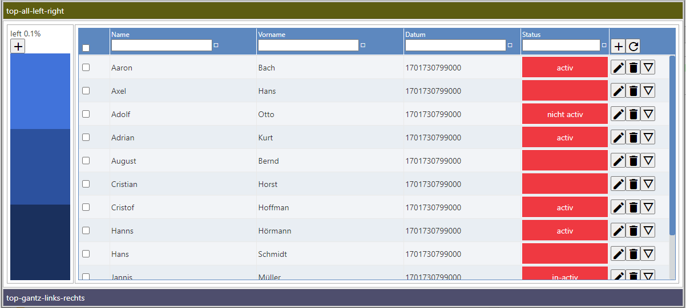

# table-responsive-app & table-responsive-lib

This project was generated with [Angular CLI](https://github.com/angular/angular-cli) version 16.2.0.



## Config
````agsl
config: IResponsiveTableConfig = {
    showCheckHeader:  true,                           // ---------NOT IMPLEMENTED
    onSelectRow:      Function,          // onClickRow -> implicit selected
    displayTableName: true,
    displayFooter:    true,
    // headerHeight:     50,        // default auto
    footerHeight:     60,           // default 50
    rowHeight:        40,           // default 50 ---------NOT IMPLEMENTED

    showLoading:      true,
    scrollV:          true,         // not implemented DEFAULT
    scrollH:          false,        // ---------NOT IMPLEMENTED
    language:         'de',
    messageTableNoData: 'There are no data to display!',

    selectionType: SelectionType.multi,         // ---------NOT IMPLEMENTED
  };
````

````agsl
<lib-table-responsive
        class="material expandable virtualized"
        [rows]="dataStruct.data"
        [config]="config"
        [selected]="selected"
        [droggableColumns]="false"  <--! not implemented -->
        [droggableRows]="true"
      >
        <lib-table-responsive-column key="checkbox" name="" [width]="50" [maxWidth]="50" [minWidth]="50"
                                     [headerTemplate]="checkbox_header_Template"
                                     [cellTemplate]="checkbox_cell_Template">
        </lib-table-responsive-column>

        <ng-container *ngFor="let structEl of structureElem.atts;">
          <lib-table-responsive-column key="{{structEl.key}}" name="{{structEl.name}}" [style]="getStyle(structEl.key)">
            <ng-template let-row="row" let-value="value" let-rowIndex="rowIndex" lib-table-responsive-cell-template>
              <div [style]="hasCustomStyle(structEl.key, row)">{{row[structEl.key]}}</div>
            </ng-template>
          </lib-table-responsive-column>
        </ng-container>

        <lib-table-responsive-column key="" name="" [width]="100" [maxWidth]="100" [minWidth]="100"
                                     [headerTemplate]="right_header_Template"
                                     [cellTemplate]="right_cell_Template">
        </lib-table-responsive-column>

      </lib-table-responsive>
````


# Build & compile
[install_build.md](install_build.md)
